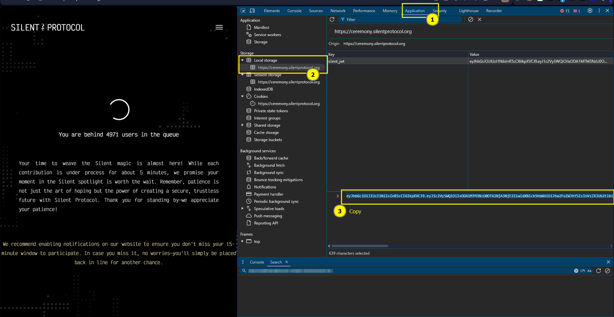

# Story Protocol Bot
Node.js implementation to monitor the entry queue. Instead of having your device on as much as the queue time, it's better to use this bot.

## Prerequisites
- Node.js v16 or higher
- npm
- JWT Token from your account:
    - Login to your Story Protocol account on your PC Browser.
    - Open Inspect Element or `ctrl` + `shift` + `c`
    - Copy your Token.


## Installation
1. Clone this repository
```
git clone https://github.com/aritlhq/silent-protocol.git
cd silent-protocol
```

2. Install dependencies:
```
npm install
```

## Usage
```
npm run start

# and paste your Token on your Terminal
```

## Donations
If you would like to support the development of this project, you can make a donation using the following addresses:


- **Solana**: `AyqspD9yMBWNTq7jv8dUx9YLgvctsaGdVGN8oGmZn2np`
- **EVM**: `0xFFc3448Fb50d9B053e7Ae03B72f45c85fC0EfC56`

## Licence

[MIT License](./LICENSE)
